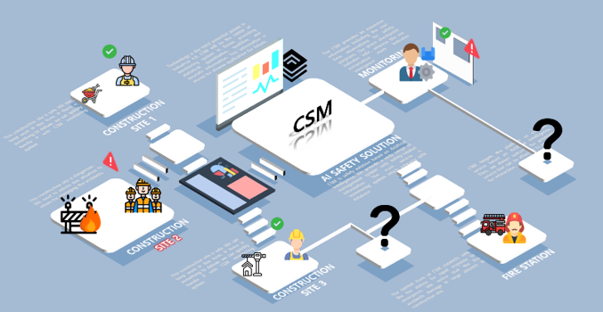

# CSM: Construction Safety Management system

<p align="center">
  
</p>

### 1. 서비스 소개
- 개요: 공사현장에서의 최적의 안전진단기술을 통한 고도화된 시스템으로 개선하고자 함
- 목표: 안전 관련 주요 시각데이터를 Cross-Domain으로 활용하여 통합 안전 관리기술의 새로운 가치 창출
*** 

### 2. Team-SCV 멤버
| Name   | 배현재  | 안재주 | 홍상훈 | 곽영상 |
|--------|--------|--------|-------|--------|
| Role   | Leader | 연구 및 개발 | 연구 및 개발 | 연구 및 개발 |
| Figure |  |  |  |  |
|        |        |   |   |   |
*** 

### 3. 활용 데이터셋
1. [공사현장 안전장비 데이터](https://aihub.or.kr/aidata/33921)
2. [화재 발생 예측 데이터](https://aihub.or.kr/aidata/34121)

<p align="center">
  
</p>

*** 


### 4. 환경 구성
```
1. git clone https://github.com/Team-SCV/CSM.git
2. cd CSM
3. pip install -r requirements.txt
```
4. [Download Model Pretrained Weights](https://drive.google.com/drive/folders/1_-vTAHq61o6j12FOhumvNmscH0ob0CkN?usp=sharing)
5. [Download Monitoring Data](https://drive.google.com/drive/folders/1_-vTAHq61o6j12FOhumvNmscH0ob0CkN?usp=sharing)

*** 


### 5. 구동 방법
```
1. CSM 환경 구성
2. [Pretrained Weights, Monitoring Data] 다운로드 및 위치시키기
  2.1 Model/
           Pretrained Weights
  2.2 Monitoring_gif/
           Monitoring Data
3. 프로젝트 폴더 내 Model 디렉토리에 저장
4. streamlit run CSM.py
```
*** 


### 6. Reference Repo

[Yolov5](https://github.com/ultralytics/yolov5)

*** 
